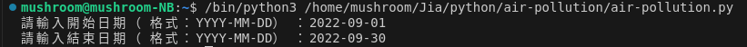
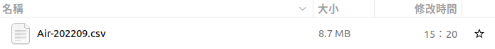

## **空氣汙染**

資料來源自[環境部環境資料開放平臺](<https://data.moenv.gov.tw/>)，先至網站註冊會員得到API，再點選開發指南至[資料擷取API線上說明文件](<https://data.moenv.gov.tw/swagger/>)

## **Package**

先安裝我們要使用的套件，分別為requests、pandas、datetime及time：
* request：抓取網路資料，對網站發出請求
* pandas：處理資料及csv文件
* datetime：處理日期
* time：每次請求間格的時間

```python
import requests
import pandas as pd
from datetime import datetime
import time
```

## **爬蟲**

### **crawl_and_append_csv**

這步是要從我們指定的網站去下載csv檔，併進空的資料集裡
* combined_df 存放每次下載資料的資料集
* pd.read_csv 讀取csv檔的資料
* pd.concat 將每次下載的資料合併
### **date_range**

這步是抓取時間內的資料，由於每次下載上限是1000筆，所以是分批下載，最後將所有檔案合併成一個CSV檔
* start_date、end_date：爬取資料的開始和結束日期
* api_key：API金鑰
* limit：每次爬取資料的筆數（最大1000筆）
* output_path：輸出的路徑

```python
def crawl_and_append_csv(url, combined_df):
res = requests.get(url)
data_csv = pd.read_csv(url)
combined_df = pd.concat([combined_df, data_csv], ignore_index=True)
return combined_df, len(data_csv)

def date_range(start_date, end_date, url_template, api_key, limit, output_path):
start_date_str = datetime.strptime(start_date, "%Y-%m-%d").strftime("%Y-%m-%d")
end_date_str = datetime.strptime(end_date, "%Y-%m-%d").strftime("%Y-%m-%d")
combined_df = pd.DataFrame()
offset = 0

while True:
url = url_template.format(start_date_str, end_date_str, api_key, offset, limit)
combined_df, current_batch_size = crawl_and_append_csv(url, combined_df)

# 檢查抓取的資料數量，如果少於 limit，則說明已經抓完，跳出循環

if current_batch_size < limit:
break

# 更新 offset
offset += limit
time.sleep(1)

# 將合併後的資料寫入 CSV 檔案
combined_df.to_csv(output_path, index=False, encoding='utf-8')

# 定義起始和結束日期
start_date = input("請輸入開始日期（格式：YYYY-MM-DD）：")
end_date = input("請輸入結束日期（格式：YYYY-MM-DD）：")

# api 金鑰

api_key = "輸入自己的API"

# limit 是每次下載的筆數，一次最多只能下載 1000 筆
limit = 1000
# 存放路徑與檔名
output_path = "/home/mushroom/Jia/python/air-pollution/Air-202209.csv"

url_template = "https://data.moenv.gov.tw/api/v2/aqx_p_488?&format=csv&filters=datacreationdate,GR,{0}|datacreationdate,LE,{1}&api_key={2}&offset={3}&limit={4}"

date_range(start_date, end_date, url_template, api_key, limit, output_path)
```

輸入日期：



結果：

