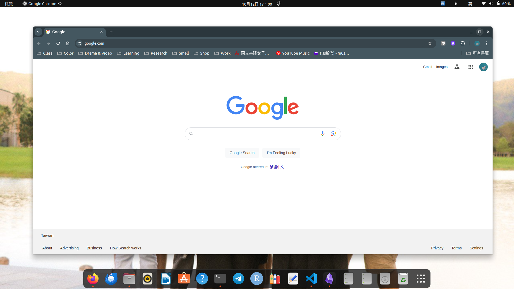
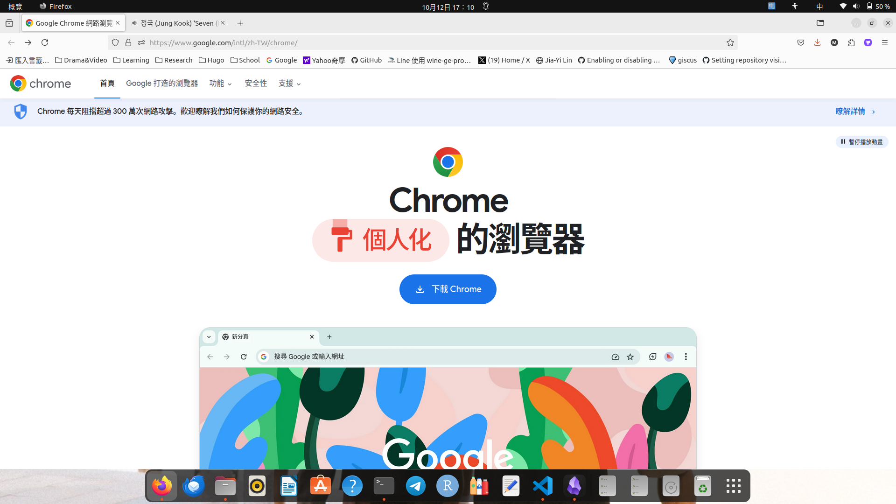
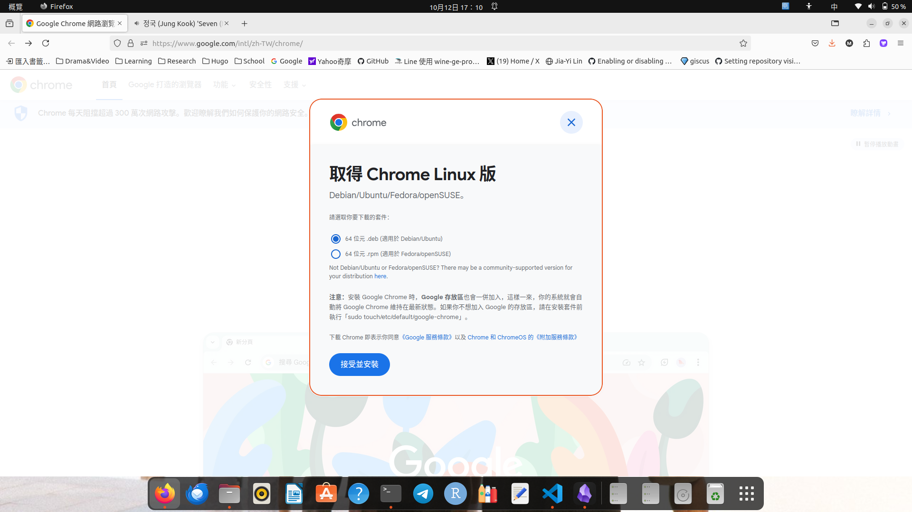
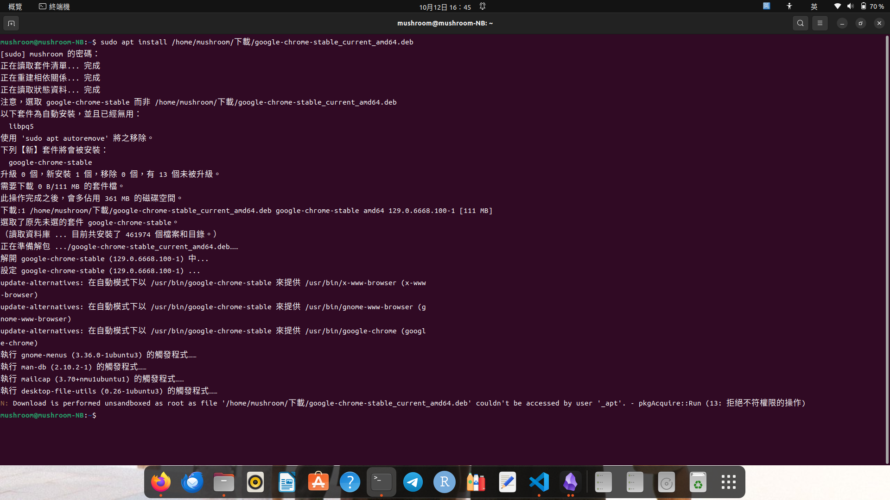

Now, let's learn how to install Chrome on Ubuntu.

1. First, we have to download debian package on [Google Chrome](https://www.google.com/intl/zh-TW/chrome/), please click **Download Chrome**.


2. Click that **64 位元 .deb** to get the debian pckage.


3. Open terminal to enter command to complete installation!
```console
$ sudo apt install /home/mushroom/下載/google-chrome-stable_current_amd64.deb
```

